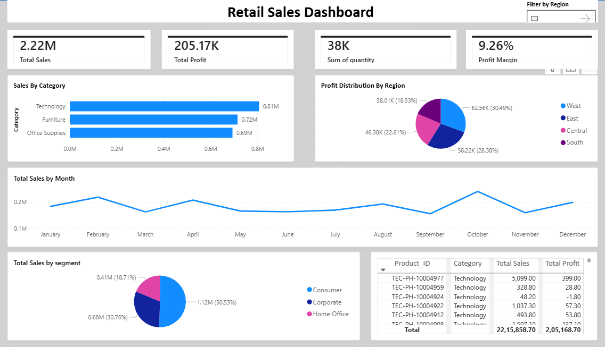
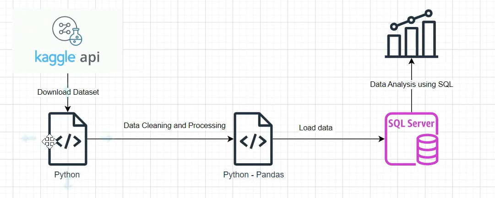

# 📊 Retail Data Analytics Project

## 🚀 Overview

This project demonstrates an end-to-end data analytics workflow using **Python, SQL, and Power BI** to analyze retail sales data and generate actionable business insights.

It covers data extraction, transformation, analysis, and interactive dashboard visualization.

---

## 🧰 Tech Stack

* **Python** (Pandas, NumPy)
* **SQL** (Data querying & transformation)
* **Power BI** (Dashboard & visualization)
* **VS Code** (Development environment)

---

## 📁 Project Structure

```
Retail-data-analytics/
│
├── Sales_Dashboard/
│   ├── Sales-Dashboard.pbix
│   ├── Retail_Sales_Dashboard.png
│
├── Python-SQL-Analysis/
│   ├── Order Data Analysis.ipynb
│   ├── orders data analysis.py
│   ├── SQLQuery3.sql
│   ├── orders.csv
│
├── project_architecture.png
└── README.md
```

---

## 📊 Power BI Dashboard

### 🔑 Key Metrics

* 💰 Total Sales: **2.22M**
* 📈 Total Profit: **205.17K**
* 📦 Total Quantity: **38K**
* 📊 Profit Margin: **9%**

### 📌 Features

* Sales analysis by **Category & Segment**
* Profit distribution by **Region**
* Monthly sales trend analysis
* Interactive filtering using slicers

---

## 📷 Dashboard Preview



---

## 🐍 Python & SQL Analysis

### 🔍 Key Tasks

* Data cleaning and preprocessing using **Pandas**
* SQL queries for extracting business insights
* Exploratory Data Analysis (EDA)

### 📌 Insights Generated

* Technology category drives highest revenue
* October shows peak sales performance
* West region contributes maximum profit
* Certain products show negative profit trends

---

## 🧠 Business Insights

* Focus on high-performing categories like **Technology**
* Improve profitability in low-performing regions
* Optimize inventory based on monthly trends
* Identify and address loss-making products

---

## 🏗️ Project Architecture



---

## ⚙️ How to Run

### Python Analysis

```bash
pip install -r requirements.txt
python "orders data analysis.py"
```

### Power BI

* Open `Sales-Dashboard.pbix` in **Power BI Desktop**

---

## 🎯 Key Highlights

* End-to-end data analytics project
* Integration of Python, SQL, and BI tools
* Real-world business problem solving
* Interactive dashboard for decision-making

---

## 📌 Future Improvements

* Add real-time data integration
* Deploy dashboard to Power BI Service
* Automate ETL pipeline

---

## 👤 Author

**Keshab Pal**

---
